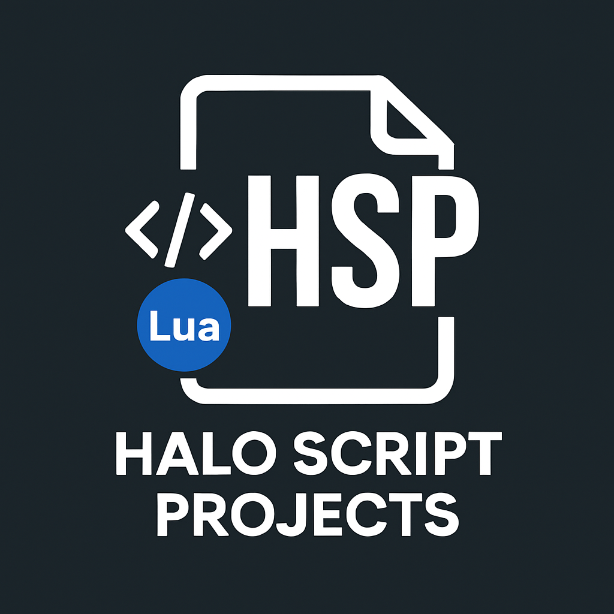

  

   

  

  

  

 

**Educational Content Moved:** All my Halo guides, tutorials, Code snippets, and reference materials have moved to my
personal website. Visit [chalwk.github.io](https://chalwk.github.io/blog) for articles on SAPP scripting, VPS hosting,
port forwarding, memory offsets, and more. **All SAPP/Phasor Lua scripts are still available here.**

---

## Table of Contents

1. [Overview](#overview)
2. [What are SAPP & Phasor?](#what-are-sapp--phasor)
3. [Scripts, Releases and Knowledge Base](#scripts-releases-and-knowledge-base)
4. [Community Favorites](#community-favorites)
5. [Integration Tools](#integration-tools)
6. [Contribute & Request Features](#contribute--request-features)
7. [Community Hubs](#community-hubs)
8. [Shoutout to Clans (Past and Present)](#shoutout-to-clans-past-and-present)
9. [Halo Custom Edition Installer](#halo-custom-edition-installer)
10. [Support My Work](#support-my-work)
11. [Contributors](#contributors)
12. [Code of Conduct](#contributors--community-guidelines)

---

## Overview

Welcome to the **Halo Script Projects (HSP)** repository! This repository contains a personally curated collection of
Lua scripts, utilities, and resources for Halo: Combat Evolved (PC) and Halo: Custom Edition (CE) dedicated servers,
created and maintained by me.

If you are a server administrator or operator using SAPP or Phasor, you will find a wide range of scripts, guides, and
insights to enhance, customize, and extend your multiplayer server experience.

---

## What are SAPP & Phasor?

**SAPP** and **Phasor** are server-side extensions that provide advanced scripting and customization capabilities for
**Halo: PC** and **Halo: CE** dedicated servers.

**SAPP**, developed and maintained by **sehé** ([halo.isimaginary.com](http://halo.isimaginary.com)), is the most
feature-rich and widely used extension. It provides powerful Lua scripting support, anti-cheat tools, event hooks,
command handling, player management, logging, and numerous under-the-hood features.

**Phasor** was an earlier server extension with similar goals. Though no longer actively maintained, it remains
compatible with many scripts and still sees use in some legacy setups.

---

## Scripts, Releases and Knowledge Base

| Category                                                                | Description                                                              |
|-------------------------------------------------------------------------|--------------------------------------------------------------------------|
| [**SAPP Scripts**](./sapp)                                              | Attractive, Custom Games, Utilities                                      |
| [**Phasor Scripts**](./phasor)                                          | Phasor Scripts                                                           |
| [**Releases**](https://github.com/Chalwk/HALO-SCRIPT-PROJECTS/releases) | Larger SAPP projects with advanced functionality beyond standard scripts |
| [**Knowledge Base (docs)**](https://chalwk.github.io/blog/#page-1)      | Documentation and community knowledge base                               |

---

## Community Favorites

Click to expand

| Category         | Script                                                                |
|------------------|-----------------------------------------------------------------------|
| **Attractive**   | [Capture The Flag](./sapp/attractive/capture_the_flag.lua)            |
|                  | [Custom Teleports](./sapp/attractive/custom_teleports.lua)            |
|                  | [Deployable Mines](./sapp/attractive/deployable_mines.lua)            |
|                  | [Rank System](./sapp/attractive/rank_system.lua)                      |
|                  | [Sprint System](./sapp/attractive/sprint_system.lua)                  |
|                  | [Tactical Insertion](./sapp/attractive/tactical_insertion.lua)        |
|                  | [Tea Bagging](./sapp/attractive/tea_bagging.lua)                      |
|                  | [Uber](./sapp/attractive/uber.lua)                                    |
|                  | [Vanish](./sapp/attractive/vanish.lua)                                |
| **Custom Games** | [Divide and Conquer](./sapp/custom_games/divide_and_conquer.lua)      |
|                  | [Gun Game](./sapp/custom_games/gun_game.lua)                          |
|                  | [Kill Confirmed](./sapp/custom_games/kill_confirmed.lua)              |
|                  | [Melee Attack](./sapp/custom_games/melee_attack.lua)                  |
|                  | [One In The Chamber](./sapp/custom_games/one_in_the_chamber.lua)      |
|                  | [Snipers Dream Team](./sapp/custom_games/snipers_dream_team.lua)      |
|                  | [Tag](./sapp/custom_games/tag.lua)                                    |
|                  | [Zombies Standard](./sapp/custom_games/zombies_standard.lua)          |
|                  | [Zombies Advanced](./sapp/custom_games/zombies_advanced.lua)          |
| **Utility**      | [AFK System](./sapp/utility/afk_system.lua)                           |
|                  | [Anti Impersonator](./sapp/utility/anti_impersonator.lua)             |
|                  | [Auto Message](./sapp/utility/auto_message.lua)                       |
|                  | [Custom Loadouts](./sapp/utility/custom_loadouts.lua)                 |
|                  | [Delay Skip](./sapp/utility/delay_skip.lua)                           |
|                  | [Dynamic Ping Kicker](./sapp/utility/dynamic_ping_kicker.lua)         |
|                  | [Dynamic Score Limit](./sapp/utility/dynamic_score_limit.lua)         |
|                  | [Liberty Vehicle Spawner](./sapp/utility/liberty_vehicle_spawner.lua) |
|                  | [Notify Me](./sapp/utility/notify_me.lua)                             |
|                  | [Race Assistant](./sapp/utility/race_assistant.lua)                   |
|                  | [Server Logger](./sapp/utility/server_logger.lua)                     |
|                  | [Team Shuffler](./sapp/utility/team_shuffler.lua)                     |
|                  | [Weapon Assigner](./sapp/utility/weapon_assigner.lua)                 |
|                  | [Word Buster](./sapp/utility/word_buster.lua)                         |

---

## Integration Tools

### SAPPDiscordBot

A Java application that uses the [JDA API](https://github.com/discord-jda/JDA) to connect Halo SAPP server events to
Discord, providing real-time alerts, structured embeds, and a GUI interface for monitoring your servers.

**Features:**

- Real-time event monitoring for multiple Halo servers
- Rich Discord embeds with customizable templates
- GUI interface for easy configuration
- Support for all SAPP event types (joins, deaths, scores, chat, etc.)
- Cross-platform (Windows & Linux)

**[→ Visit SAPPDiscordBot Repository](https://github.com/Chalwk/SAPPDiscordBot)**

---

## Contribute & Request Features

### Submit Ideas

Have an idea for a new feature or script?  
[Submit Feature Request](https://github.com/Chalwk/HALO-SCRIPT-PROJECTS/issues/new?template=FEATURE_REQUEST.yaml)

### Report Issues

- [Bug Report Form](https://github.com/Chalwk/HALO-SCRIPT-PROJECTS/issues/new?assignees=Chalwk&labels=Bug%2CNeeds+Triage&projects=&template=BUG_REPORT.yaml&title=%5BBUG%5D+%3Ctitle%3E)
- [Feature Request Form](https://github.com/Chalwk/HALO-SCRIPT-PROJECTS/issues/new?assignees=Chalwk&labels=Feature%2CNeeds+Review&projects=&template=FEATURE_REQUEST.yaml&title=%5BFEATURE%5D+%3Ctitle%3E)

---

## Community Hubs

- [Open Carnage](https://opencarnage.net) - [Discord](https://discord.gg/2pf3Yjb)
- [Chimera](https://opencarnage.net/index.php?/topic/6916-chimera-download-source-code-and-discord/) - [Discord](https://discord.gg/ZwQeBE2)
- [Halo Net](https://halonet.net/) - [Website](https://halonet.net/)
- [XG Gaming](https://www.xgclan.com) - [Website](https://www.xgclan.com)
- [POQ Clan](http://poqclan.com/) - [Website](http://poqclan.com/)
- [Bigass](https://discord.gg/yUKg56uhqG) - [Discord](https://discord.gg/yUKg56uhqG)
- [BK (BlacksHalo)](https://www.blackshalo.com) - [Website](https://www.blackshalo.com)
- [Liberty](https://discord.gg/3J2Zppghz5) - [Discord](https://discord.gg/3J2Zppghz5)
- [Reclaimers](https://c20.reclaimers.net/) - [Discord](https://discord.reclaimers.net/)
- [Realworld CE](https://www.realworldce.com/)
- [Old School Halo (OSH)](https://discord.gg/5gvn6T6vXe) - [Discord](https://discord.gg/5gvn6T6vXe)

---

## Shoutout to Clans (Past and Present)

> \- YAS -, -db-, «§», «Ag~, «Ð²Ä», «MAD», [Aķ], [CV], [GTV], [HGE], [IG], [IS], [K2], [McK], [Nbk], [VR], [WFFF], ]
> ZTA[. VSA, {ATP}, {BK}, {CK}, {CRG}, {HWS}, {LoH}, {NR}, {OTH}, {ØZ}, {PWH}, {SK}, {SSC}, {V3}, {X}, {XF} = SL =,
> {XG}, = EP =, = NcS =, = XA=, =DN=, =RDA=, £V», ÄÄÄ, AOD, AR, BR, BZ, C#w, CAF, CB, CES, CGD, CHr, CK, ÇM, CODE, CSI,
> CST, DFS, DR, Ðu¥, EK, ev, FCM, Fem1, Fez`, FIG, FooK, GDS, GoD, GRO, HH, HSF, HTK3, IR, KB, KMT, KoD, KoF, LaG, LF,
> LIB, LNZ, LP, LTD2, M5, MR, MVL, ňc, ÑE», ñuß, OSR, OWV, P§ycho, PÕQ, PRO, RC, RSF, SAR, SB, SDR, ßE, TBR, TCS, TFT,
> TM,
> ToR, X¬, xOSHx, xT

If you would like your clan tag added to this list, please [contact me](#contact).

---

## Halo Custom Edition Installer:

**Note:** You need your own CD Key to install this.

[halo_ce_installer.zip](https://drive.google.com/file/d/1TTiBYhO9JS5Js0exRlygH9pAC2yV1KsV/view?usp=sharing)  
[haloce-patch-1.0.10.zip](https://drive.google.com/file/d/1CIPg3XZ3VIm4ngUnDqLCRNSn9x-jxD6W/view?usp=drive_link)

### LAA Patched Executables

These are Large Address Aware (LAA) patched versions of Halo executables, allowing the game to use more than 2 GB of RAM
on 64-bit systems:

- [Download Page](https://github.com/Chalwk/HALO-SCRIPT-PROJECTS/releases/tag/laa_patched)

---

## Support My Work

Enjoy these projects? Help me continue development:

- ☕ [Donate via PayPal](https://www.paypal.com/ncp/payment/XUPTKDU6LKM3G)
- **Star ⭐ this repository** to show appreciation and stay updated!

---

## Contributors

Special thanks to all contributors!  
See our [Contributing Guide](https://github.com/Chalwk/HALO-SCRIPT-PROJECTS/blob/master/CONTRIBUTING.md)

---

## Contributors & Community Guidelines

See our [Contributing Guide](https://github.com/Chalwk/HALO-SCRIPT-PROJECTS/blob/master/CONTRIBUTING.md) to learn how to
get involved.

All community interactions are governed by
our [Code of Conduct](https://github.com/Chalwk/HALO-SCRIPT-PROJECTS/blob/master/CODE_OF_CONDUCT.md)

---